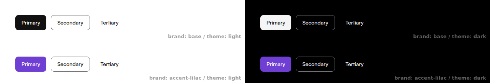
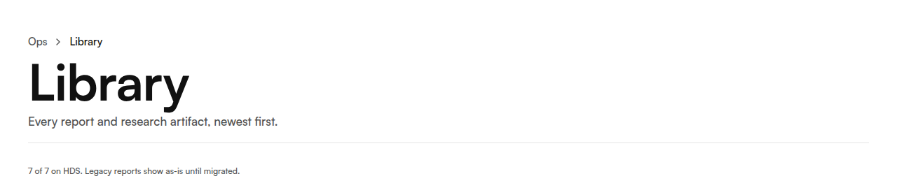
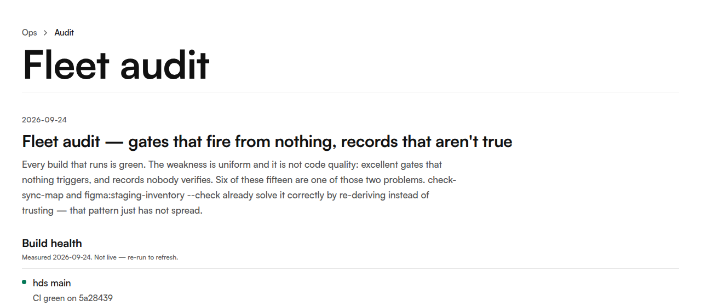

# Hirobius Design System

[](https://github.com/hirobius/hds/actions/workflows/ci.yml) [](https://www.npmjs.com/package/@hirobius/design-system) [](https://hirobius-design-system.vercel.app)

React + TypeScript component library on a governed design-token pipeline. Live Storybook: **<https://hirobius-design-system.vercel.app>**

```bash
pnpm add @hirobius/design-system
```

[](https://hirobius-design-system.vercel.app)

<!-- auto:start:front-door-counts -->

- **57** public component modules, exported from `src/index.ts`
- **385** DTCG tokens in `hirobius.tokens.json`, compiled to CSS variables and TypeScript constants
- **346** Storybook stories in **73** story files

<!-- auto:end:front-door-counts -->

- Theming through four root attributes and CSS variables (theme, density, brand, font) that need no JavaScript
- Deterministic gates in git hooks and CI: typecheck, zero-warning ESLint, token validity and contrast, Vitest unit and contract tests, bundle budgets, a consumer smoke build, and a Storybook build

The counts are generated from source by `pnpm readme:counts`, which `pnpm tokens` also runs. `scripts/__tests__/front-door.test.mjs` fails if this README claims more than the source has.

Agents: install the consumer skill with `npx skills add hirobius/hds --skill hds-consumer` (see `docs/CONSUMING.md`, "Agent skill").

## In use

<!-- auto:start:consumer-usage -->

The Ops dashboard (`hirobius/ops`) is the only product app that uses components: **33** of its source files import from `@hirobius/design-system`, using **25** distinct components. The two screenshots below are Ops pages rendered from its `main` (measured at commit `76ef65e`).

| Consumer kind     | Count | How it uses HDS                           |
| ----------------- | ----- | ----------------------------------------- |
| Product apps      | 1     | Components and tokens                     |
| Token-level sites | 4     | Tokens and CSS only, no component imports |

[](docs/images/ops-library.png)

[](docs/images/ops-fleet-audit.png)

<!-- auto:end:consumer-usage -->

The numbers come from `pnpm consumer:usage --root <ops checkout>`, which measures that checkout's `src/` and records its commit in `docs/data/consumer-usage.json` (pass `--commit <sha>` when the root is a `git archive` export); without a root it reuses the committed snapshot. A deprecated alias counts as the component it points to (`HdsCheckbox` as `Checkbox`). The components that Ops's page- and video-clone prompts tell generated code to import are listed there as `promptContracts` and are not counted here. `scripts/__tests__/consumer-usage.test.mjs` fails if this section drifts from that snapshot. The product-app and token-level-site split is a declared figure in that file, not a measurement. It was confirmed on 2026-10-01 (hds#389: there is no second product app), so `consumersConfirmed` there is true and the table above shows it.

## Using the published package

Installing HDS in another project? It ships to the **public npm registry** as
`@hirobius/design-system` (ESM) — no `.npmrc`, no token, no registry config. Full
guide: **[docs/CONSUMING.md](docs/CONSUMING.md)**.

> **Not on GitHub Packages.** This repo's **Packages** sidebar still shows an old
> `@hirobius/design-system` entry under GitHub Packages
> (`/pkgs/npm/design-system`). That listing is **frozen and no longer updated** —
> publishing moved to the public npm registry in
> [#39](https://github.com/hirobius/hds/pull/39). Always
> install from npm:
> **[npmjs.com/package/@hirobius/design-system](https://www.npmjs.com/package/@hirobius/design-system)**.

The short version:

```bash
npm install @hirobius/design-system react react-dom
# react-router is an OPTIONAL peer — only if you want HDS links to drive your router
```

```tsx
// once at the app root — full bundle: tokens + theme + utilities + embedded fonts
import '@hirobius/design-system/tokens.css';
import { Button } from '@hirobius/design-system';

// add data-hds to the root (or any section) so the scoped base styles apply
export const App = () => (
  <div data-hds>
    <Button>Get started</Button>
  </div>
);
```

No router, Tailwind config, or font files needed. With a router, inject it once
via `<HdsRouterProvider>`. See **[docs/CONSUMING.md](docs/CONSUMING.md)** for the
router seam, `data-hds` scoping, and MUI coexistence.

### Theming: the four dials

HDS theming is driven by root attributes + CSS variables, so it works with **zero
JavaScript** — set them on any element (React, Astro, plain HTML) and every HDS
descendant re-skins:

| Dial    | Attribute / var                                | Values          | Default              |
| ------- | ---------------------------------------------- | --------------- | -------------------- |
| theme   | `data-theme`                                   | `dark`          | light (unset)        |
| density | `data-density`                                 | `compact`       | comfortable (unset)  |
| brand   | `data-brand` (+ `data-tenant` alias)           | overlay slug    | base (unset)         |
| font    | `--hds-font-family` / `--hds-font-family-mono` | any font-family | Satoshi / Geist Mono |

```html
<!-- zero-JS: static markup (e.g. an Astro layout) -->
<div
  data-hds
  data-theme="dark"
  data-density="compact"
  data-brand="acme"
  style="--hds-font-family: 'Inter', sans-serif"
>
  …
</div>
```

React apps can set the same contract declaratively with the typed
`<HdsThemeProvider>` (renders the `data-hds` scope wrapper) and read it back with
`useHdsTheme()` — it is a convenience, not a requirement:

```tsx
import { HdsThemeProvider } from '@hirobius/design-system';

<HdsThemeProvider theme="dark" density="compact" brand="acme">
  <App />
</HdsThemeProvider>;
```

## Figma ↔ code

Code is the source of truth, and sync runs one way, from code to Figma. What exists today:

- **Tokens → Figma model:** `pnpm figma:model` projects `hirobius.tokens.json` into `figma/model.json` — the Primitives, Semantic (Light/Dark), Component, Role, Brand and Density collections, plus text and effect styles. Light and Dark keep their own values.
- **Model → Figma file:** `pnpm figma:push` writes the upsert scripts that apply that model to a Figma file, and `pnpm figma:native-import` writes DTCG files for Figma's own Variables ▸ Import. Both are run by hand — no workflow pushes to Figma. The runbook is [`figma/README.md`](figma/README.md).
- **Figma → repo:** `pnpm figma:snapshot --ingest` records the file's state in `figma/snapshot.json`, and `pnpm check:figma-drift` compares the model against that committed snapshot. A hand edit in Figma is drift, not a source change.
- **Legacy export:** `pnpm figma-variables` still writes the older plugin and REST export files, now projected from the same model.
- **Components → Code Connect:** the v2 templates live in the repo, but no Code Connect mapping is published, so Dev Mode shows no snippets. Publishing Code Connect needs a Figma Organization plan.

What each Figma plan allows, and the Pro-plan architecture this follows, are in [ADR-025](docs/adr/025-figma-sync-pro-architecture.md).

## Developing this repo

```bash
pnpm install
# Generated data files are gitignored; create them once (the same step CI runs):
node scripts/generate-manifest.mjs && node scripts/generate-component-api.mjs && node scripts/enrich-manifest.mjs && node scripts/sync-icons.mjs && node scripts/audit-tokens.mjs --full
pnpm storybook   # component workbench on http://localhost:6006
```

Core verification commands:

```bash
pnpm typecheck
pnpm lint
pnpm test              # pretest gates + unit + contract tests, exactly as the pre-push hook and CI run them
pnpm tokens:verify
pnpm check:size
pnpm build-storybook
```

## Architecture

HDS is built around three structural rules:

- **Strict semantics** — public surfaces prefer system primitives such as `Stack`, `Grid`, `Surface`, and `Text` instead of raw layout divs or ad hoc CSS.
- **Polymorphism** — primitives preserve semantic HTML while staying composable through governed APIs such as `forwardRef`, `as`, and layout slots.
- **12-column grid** — page structure follows a consistent editorial grid: readable center columns, intentional breakout zones, and explicit `gap` ownership rather than one-off spacing math.

Source-of-truth files:

- `hirobius.tokens.json` — token values and alias chain.
- `public/hds-manifest.json` — machine-readable system inventory, metadata, and docs linkage.
- `src/app/data/component-api.json` — generated prop tables and reflected component API.
- `DESIGN.md` — lean visual spec for agents and engineers.
- `DESIGN-HANDOFF.md` — verbose visual mirror for handoff and review.

Component-by-component Figma links live in [docs/DESIGN_LINKS.md](docs/DESIGN_LINKS.md), generated by `pnpm figma:links`.

## Accessibility

What CI and the hooks check today, and nothing more:

- **Contrast:** `scripts/check-contrast.mjs` enforces WCAG AA contrast on the core token pairs, in light and dark. It runs in CI and the pre-commit hook.
- **Lint:** `jsx-a11y` rules run inside ESLint with zero warnings allowed.
- **Focus:** `scripts/check-focus-states.mjs` (`pnpm check:focus`) audits focus styles on interactive components. It runs in `pretest` under `pnpm test`, so in the pre-push hook and in CI, and passes with 0 violations.
- **Storybook:** the `addon-a11y` panel shows axe results for each story while you review it. The gate is `scripts/check-storybook-axe.mjs`: CI scans every built story in light and dark, including the open Select and Combobox, and fails on serious or critical violations outside its allowlist (`scripts/axe-allowlist.json`). The allowlist has one entry: `aria-hidden-focus` on the open Select story, where Radix Select hides the page around its listbox while focus stays trapped inside it (hds#407).

Screen-reader output is checked by `tests/primitive-contracts/screen-reader.contract.test.tsx`, which runs in `pnpm test` and walks Dialog, Menu, Select, Combobox, Table and Alert with a virtual screen-reader (`@guidepup/virtual-screen-reader`) under jsdom, asserting the role, name and state phrases it reads and the alert's live-region announcement; it reads the jsdom accessibility tree, not what a desktop or mobile screen-reader says.

## Visual direction: Editorial Enterprise

The governing direction is "Editorial Enterprise" — enterprise rigor with editorial pacing. It favors sharp hierarchy, open whitespace, monochrome neutrals, and a single electric-blue accent. In practice:

- documentation reads like a designed publication, not a component dump
- cards are used sparingly; whitespace, rails, dividers, and bands carry structure first
- motion clarifies rather than decorates
- surfaces, spacing, and type are token-governed, so the visual language stays coherent across the docs site and any consuming app

## Verification workflow

The gates are deterministic and need no browser or live site:

- **pre-commit** (`.husky/pre-commit`): secrets scan, Prettier on staged files, typecheck, zero-warning ESLint, and token validity and contrast.
- **pre-push** (`.husky/pre-push`): `pnpm test` (the pretest gates, then Vitest unit and contract tests), then the consumer smoke build (library build, subpath resolution, publint, consumer typecheck).
- **CI** (`.github/workflows/ci.yml`): typecheck, zero-warning ESLint, token validity and contrast, Vitest, and the consumer smoke build, plus bundle budgets and a Storybook build.
- **Visual review:** Storybook is the visual verification surface, reviewed by hand. The earlier browser test suite drove a docs site that no longer exists and was removed (ADR-018).

### Agent consistency

Three agents build the same Client-detail screen from the public docs, and `pnpm eval:consistency` measures how alike the results are: builds, token violations, axe, component-set overlap (Jaccard) and pixel diff. Today it runs the offline half over a directory of apps (`pnpm eval:consistency -- --apps <dir> --offline`, violations and Jaccard from source only). The ledger, the thresholds and the screen spec live in [`eval/consistency/`](eval/consistency/README.md). The latest recorded run, as printed by `pnpm eval:consistency -- --summary`:

```text
Agent consistency 2026-09-30 (harness, design-system 0.18.0): FAIL - builds 3/3, violations 0, axe 0, Jaccard min 0.7368 (limit >= 0.85), light diff max 1.0268% (limit <= 1.5%)
```

The baseline misses its thresholds on purpose: they are not softened to make it pass.

`CLAUDE.md` is the operating contract for agents working in this repo.

## Bundle and release hygiene

- `pnpm check:size` builds the library bundle and runs `size-limit`.

Releases are cut with [Changesets](https://github.com/changesets/changesets). A pull request that changes the published package adds a changeset (`pnpm changeset:add`). On a push to `main`, `.github/workflows/release.yml` opens or updates a "Version Packages" PR, and merging that PR publishes the new version to public npm.

## Repository shape

```text
src/
  app/
    components/
    layouts/
    pages/
  styles/
scripts/
docs/
public/
```

## Primary docs

- [`docs/CONSUMING.md`](docs/CONSUMING.md) — installing & using the published package
- `CLAUDE.md` — agent operating contract
- `DESIGN.md` — lean visual spec
- `DESIGN-HANDOFF.md` — verbose visual mirror
- `TOKEN_GOVERNANCE.md` — token system rules
- `SYSTEMS_REGISTRY.md` — systems & guardrail registry

## License

The HDS code is MIT ([LICENSE](LICENSE)). The package CSS also embeds the Satoshi and Geist Mono fonts, which keep their own licenses and are not covered by MIT. See [NOTICE.md](NOTICE.md).
